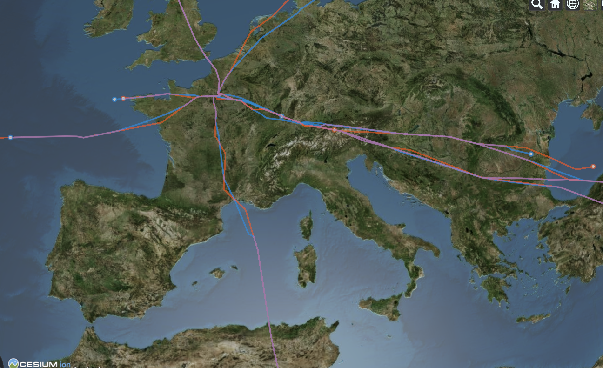

# Visualizing m1 versus m3 traffic data with CesiumJS

Generation of a CZML file from two so6 air traffic files: last filled flight plan (m1) and flight plan enhanced with radar data (m3)

This CZML file can be read by CesiumJS. The traffic is represented by :
* static objects (trajectories)
* dynamic objects (tracks)

Example: display all A380 flights from LFPG airport (m1 versus m3)

  

## Running the tests

You can verify the generated CZML file:
* either with a simple drap & drop on the online Cesium viewer [here](https://cesiumjs.org/Cesium/Build/Apps/CesiumViewer/index.html)
* either by modifying the CZML variable in the Cesium path sandbox [here](https://cesiumjs.org/Cesium/Apps/Sandcastle/index.html?src=CZML%20Path.html&label=)

With the second option, you can save an html file that you can run with a local server, see the HelloWorld.html example in Cesium Apps folder

## Built With

* [pandas](https://pandas.pydata.org/) - Python Data Analysis Library
* [CesiumJS](https://cesiumjs.org/) - Open-source JavaScript library for world-class 3D globes and maps

## Authors

* **Thomas Dubot** 

## License

This project is licensed under the MIT License - see the [LICENSE.md](LICENSE.md) file for details

